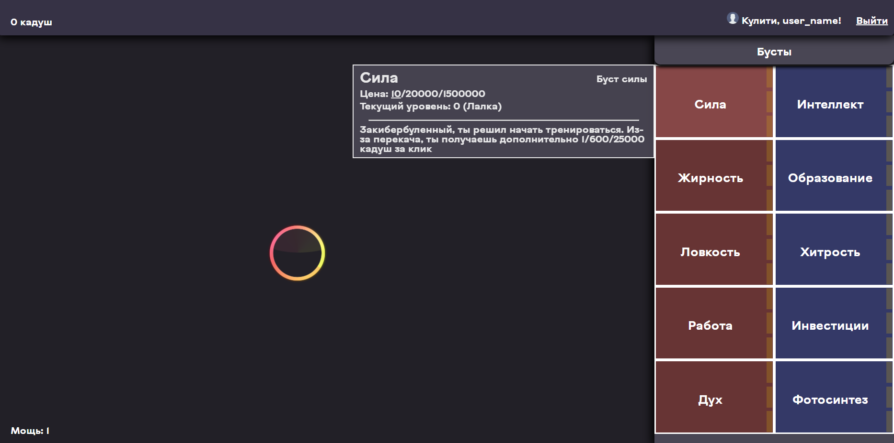

# Clicker
Простой сайт (фронт + бэк), позволяющий пользователю скоротать время.
## Скриншот
 
Слева окно игры, где игрок должен нажимать на кнопку, меняющую расположение после каждого клика, за что он получает количество очков, определямое параметром "Мощь"
#
За полученные очки игрок может приобести улучшения в магазине в правой части экрана. Улучшения имеют три уровня, делятся на два типа: красные, пассивно увеличивающие "Мощь", и синие, автоматически дающие очки, с определенным интервалом.
